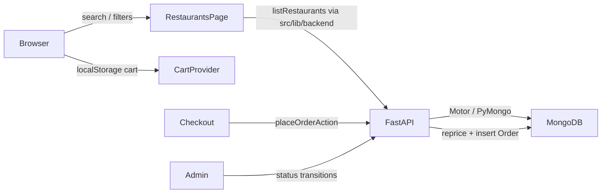

# Architecture

Two-service local demo: **Next.js App Router** (storefront + `/admin`) talks to **FastAPI** (`backend/`) over HTTP. Persistence is **MongoDB** (Atlas or local). Next owns UI, iron-session cookies, and Server Actions; FastAPI owns auth tokens, catalog, orders, and other domain writes.

## Services

| Process | Default | Role |
| --- | --- | --- |
| Next.js (`npm run dev`) | `:3000` | App Router UI, Server Actions, iron-session cookie |
| FastAPI (`uvicorn app.main:app`) | `:8000` | REST API, JWT auth, Mongo reads/writes |
| MongoDB | Atlas / local | Source of truth for users, restaurants, orders, … |

Next reaches the API via `API_BASE_URL` (default `http://127.0.0.1:8000`) through `src/lib/api.ts` and `src/lib/backend.ts`. Cloud Agents start both processes with [`scripts/cloud-agent-start.sh`](../scripts/cloud-agent-start.sh) (see [cloud-agents.md](./cloud-agents.md)).

## Data flow (browse → order)



## Location and city filtering

**Intent:** Scope restaurant browse to an Australian capital without requiring a Maps key. Keep Mongo round-trips small as the catalog grows (~650 venues in the snapshot).

| Piece | Role |
| --- | --- |
| `src/lib/cities.ts` | Canonical `DEMO_CITIES` (id + label + CBD pin). `resolveRestaurantQuery` treats a bare city name in `q` as a city filter. `matchesRestaurantCity` accepts id (`melbourne`) or label (`Melbourne`). |
| `src/components/location-provider.tsx` | Session pin in `localStorage` key `aussieeats_location_v1`. |
| `src/components/restaurant-search.tsx` | Hero/header search waits for hydration so a saved pin is not dropped, then navigates to `/restaurants?...`. |
| `src/components/location-search.tsx` | On `/restaurants` (`RestaurantsExplorer`): Places autocomplete (when Maps key is set) and **Use my location**. Writes `lat` / `lng` / `place` into the URL. |
| `GET /restaurants` (`backend/app/routers/restaurants.py`) | **Server-side** filters: `city` (Mongo query on label), then in-process `cuisine` / `q` / `diet`. City uses a case-insensitive exact label match via `find_demo_city`. Diet loads menu items for the scoped set and keeps venues where one item satisfies every selected diet. |
| `src/app/(store)/restaurants/page.tsx` | Calls `listRestaurants` with `city` / `cuisine` / `q` / `diet`. Applies **open-now** and distance/ETA in Next (needs opening-hours TZ + origin pin). Optionally sorts by Haversine when `lat`/`lng` are present. |
| `src/lib/dietary.ts` | Diet filter ids, URL parsing (`diet=…`, `allergy=nuts`). Untagged items are not treated as nut-free. Venue-level `dietaryTags` is display-only. |

**Constraints:**

- Mongo stores city as a **label** (`"Melbourne"`), not the slug id. FastAPI normalizes query city through `find_demo_city`; client helpers still use `matchesRestaurantCity` / `findDemoCity` for UI.
- Open-now stays on the Next side. Hours evaluation needs the city label for IANA TZ and is not pushed into the list API.
- Search submit must not run before `hydrated` or the city query param can be lost on first paint.
- Map pins on `/restaurants` come from the **same filtered list** as the cards (`RestaurantsExplorer`), not a separate query.
- Geolocation failure must not break the search row (APJ-23): the error alert (`data-location-search-error`) sits **below** the controls row (`data-location-search-controls`), not inside the `sm:flex-row` flex. A regression test in `location-search.test.ts` asserts that markup shape.

### Typeahead (`GET /search/suggest`)

When Atlas Search is available, FastAPI prefers the `restaurants_autocomplete` search index (name / suburb autocomplete, cuisine text, `isActive` filter). On local mongod or while the index is building it falls back to a bounded active-restaurant scan plus in-process ranking (`backend/app/routers/search.py`). Startup calls `ensure_search_indexes()`; missing Search is a silent no-op.

## Cart and money

**Intent:** Client cart for demo speed; FastAPI is the source of truth for charged totals at checkout.

| Piece | Role |
| --- | --- |
| `src/lib/cart-types.ts` | `unitPriceCents` is integer AUD cents. `cartSubtotalCents` = Σ(unit × quantity). |
| `src/components/cart-provider.tsx` | Persists `aussieeats_cart_v1`. One restaurant per cart. Quantity capped by `MAX_LINE_QUANTITY` (99). Subtotal can be swapped by the Demo lab scenario below. |
| `src/app/actions/orders.ts` → `placeOrder` in `src/lib/backend.ts` | Posts cart lines to FastAPI; backend re-reads menu prices from Mongo and ignores client unit prices for the charge. |
| `src/lib/money.ts` | Display only: `formatAUD(cents)` via `en-AU`. |

**Constraints:**

- Never pass dollars into `unitPriceCents` (regression: `priceCents / 100` broke cart totals). Admin forms convert dollars → cents with `Math.round(Number(price) * 100)`.
- Checkout recomputes subtotal from Mongo prices × validated quantities inside FastAPI.

## Demo lab (`/demo-admin`)

**Intent:** Presenter control plane for Cursor capability demos. Toggle intentional storefront faults in **this browser only**, then turn them off — no git restore. Not restaurant `/admin`.

| Piece | Role |
| --- | --- |
| `src/app/(store)/demo-admin/page.tsx` + `DemoLab` | Lists scenarios from `DEMO_SCENARIOS` with on/off switches. |
| `DemoProvider` (`src/components/demo-provider.tsx`) | Root-layout context. Persists enabled ids in `localStorage` key `aussieeats_demo_v1`. Syncs across tabs via `storage` events. |
| `src/lib/demo/scenarios.ts` | Scenario registry (`id`, capability, title, summary, reproduce steps). Currently one: `cart-subtotal-ignores-qty` (capability `debug`). |
| `src/lib/demo/cart-line-totals.ts` | Bug path: `cartSubtotalFromLines` sums **unit price once per line** (ignores quantity). |
| `CartProvider` | When that scenario is on (`useDemoEnabled`), uses `cartSubtotalFromLines` instead of `cartSubtotalCents`. Checkout still re-prices from Mongo. |
| `DemoBanner` | Fixed corner banner when any scenario is on; links back to `/demo-admin`. |

**Constraints:**

- Scenarios are client-only. Clearing `aussieeats_demo_v1` or using **Turn all off** restores healthy cart math.
- Unknown ids in storage are dropped by `parseDemoState`.
- Placed-order totals stay correct even with the cart-subtotal scenario on — that mismatch is the demo point for Cursor Debug.

## Opening hours and ETA

| Piece | Role |
| --- | --- |
| Restaurant `openingHoursJson` (Mongo) | Serialized Places-style periods / weekday descriptions (nullable). |
| `src/lib/opening-hours.ts` | `isOpenNow` evaluates periods in the city’s IANA timezone; falls back to `isOpen` when periods are missing. |
| `src/lib/eta.ts` | Demo ETA: ~18 min prep + ~3.2 min/km travel, clamped to 15–75 min. Origin is URL lat/lng, else the demo city pin. |

Runtime browse does **not** call Google. Hours/ratings come from the seed snapshot or an optional Places refresh (`npm run db:import-places` → `backend/app/import_places.py`).

## Orders and admin

| Piece | Role |
| --- | --- |
| FastAPI `orders` / `admin` routers | Create orders, list customer/admin views, status transitions. |
| `src/lib/orders.ts` | Status labels, `ALLOWED_TRANSITIONS` (mirrored in backend domain), `ORDER_STATUS_POLL_MS` (3000), quantity helpers. |
| Order `statusHistory` | Array of `{ status, at }` appended on create and admin transitions. |
| Customer timeline | `ORDER_TIMELINE_STEPS` (excludes `cancelled`). |
| `LiveOrderStatus` (`src/components/live-order-status.tsx`) | Soft-polls `pollMyOrderStatusAction` every 3s while status is non-terminal. Updates the status pill + timeline; calls `router.refresh()` when status changes. Stops on `delivered` / `cancelled`. |
| Mock courier ETA (`estimateCourierEta` in `src/lib/eta.ts`) | Client-only. Shrinks remaining time by status (`pending` full prep+travel, `preparing` ~10 min prep left + travel, `out_for_delivery` shortened travel). Origin via `resolveOrderEtaOrigin`: live demo pin → delivery suburb/state → restaurant city pin. |

Allowed transitions: `pending → preparing|cancelled`, `preparing → out_for_delivery|cancelled`, `out_for_delivery → delivered|cancelled`. Terminal states have no further transitions.

**Live tracker constraints:**

- Polling needs a session (guest or full account). There is no websocket; admin status changes show up on the next poll tick.
- Courier ETA is demo math from lat/lng, not a courier feed. Without a resolvable origin the banner stays hidden.

## Auth and sessions

**Ownership split:**

1. **FastAPI** issues JWTs (`POST /auth/login`, `POST /auth/signup`, `POST /auth/guest`) signed with `JWT_SECRET` (`backend/app/security.py`).
2. **Next** stores the Bearer token plus user fields in an iron-session cookie (`SESSION_SECRET`, cookie `aussieeats_session` via `src/lib/session.ts`). Guest sessions set `isGuest: true`.
3. Authed Server Actions / `apiFetchAuthed` send `Authorization: Bearer …`. Missing/invalid tokens clear the session.
4. Logout: best-effort `POST /auth/logout`, then clear the cookie. JWT remains client-held until expiry.

Roles `CUSTOMER` | `ADMIN` in `src/lib/roles.ts`. Route guards: `requireUser` / `requireAdmin` (require a JWT in session).

### Guest checkout

**Intent:** Place an order without forcing account signup (APJ-8).

| Step | Behavior |
| --- | --- |
| Checkout form | Logged-out (or already-guest) users enter name + email. Cart still works without login. |
| `placeOrderAction` | When guest contact is present, calls `beginGuestSession` → `POST /auth/guest`, then places the order with that JWT. |
| `POST /auth/guest` | Creates or resumes a `isGuest: true` user (random unusable password hash). Rejects emails that already belong to a real account (409). |
| Signup after guest | `POST /auth/signup` with the same email **upgrades in place** (`isGuest: false`, sets password) so prior orders keep the same `userId`. |
| Login | Guest emails cannot password-login until upgraded; login returns 401 with a guest-specific message. |

## Persistence and seed

- Collections live in Mongo (`MONGODB_URI` / `MONGODB_DB`). There is no Prisma/SQLite path.
- On API startup, `ensure_indexes()` creates uniqueness and browse-friendly indexes (notably `restaurants`: `(city, isActive)`, `(isActive, rating, name)`). Seed and Places import also call it.
- `npm run db:seed` → `cd backend && python3 -m app.seed` upserts demo users, restores `catalog_snapshot.json` when the catalog is empty (handwritten `seed_data.json` if the snapshot is missing), and seeds sample orders/reviews once (unless `FORCE_SEED_ORDERS=1`).
- Snapshot export: `npm run db:export-catalog` writes `backend/app/catalog_snapshot.json` from Mongo.
- Places refresh: `npm run db:import-places` upserts by `placeId`; photos under `public/images/imported/` (gitignored; seed falls back to stock images when missing).

## Tests

```bash
npm test                                      # tsx --test on src/**/*.test.ts
cd backend && python3 -m pytest               # FastAPI / domain tests
```
