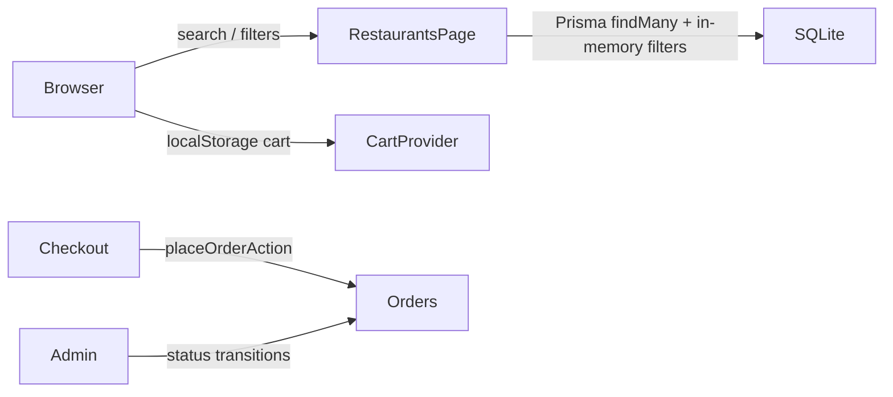

# Architecture

Local-only Next.js App Router app. Customer storefront under `src/app/(store)`, admin under `src/app/admin`, shared domain logic in `src/lib`, Server Actions in `src/app/actions`. Persistence is Prisma + SQLite (`prisma/dev.db`).

## Data flow (browse → order)



## Location and city filtering

**Intent:** Scope restaurant browse to an Australian capital without requiring a Maps key.

| Piece | Role |
| --- | --- |
| `src/lib/cities.ts` | Canonical `DEMO_CITIES` (id + label + CBD pin). `resolveRestaurantQuery` treats a bare city name in `q` as a city filter. `matchesRestaurantCity` accepts id (`melbourne`) or label (`Melbourne`). |
| `src/components/location-provider.tsx` | Session pin in `localStorage` key `aussieeats_location_v1`. |
| `src/components/restaurant-search.tsx` | Hero/header search waits for hydration so a saved pin is not dropped, then navigates to `/restaurants?...`. |
| `src/app/(store)/restaurants/page.tsx` | Loads active restaurants, filters by `q` / cuisine / city / open-now / diet+allergy, optionally sorts by Haversine distance when `lat`/`lng` are present. |
| `src/lib/dietary.ts` | Diet filter ids, URL parsing (`diet=…`, `allergy=nuts`), conservative item match (untagged ≠ nut-free). A venue matches only when one item satisfies every selected diet, so browse results and the filtered menu agree; the venue-level `dietaryTags` union is display-only. |

**Constraints:**

- DB stores city as a **label** (`"Melbourne"`), not the slug id. Always match via `matchesRestaurantCity` / `findDemoCity`.
- Search submit must not run before `hydrated` — otherwise the city query param can be lost on first paint.
- Map pins on `/restaurants` come from the **same filtered list** as the cards (`RestaurantsExplorer`), not a separate query.

## Cart and money

**Intent:** Client cart for demo speed; server is the source of truth for charged totals at checkout.

| Piece | Role |
| --- | --- |
| `src/lib/cart-types.ts` | `unitPriceCents` is integer AUD cents. `cartSubtotalCents` = Σ(unit × quantity). |
| `src/components/cart-provider.tsx` | Persists `aussieeats_cart_v1`. One restaurant per cart. Quantity capped by `MAX_LINE_QUANTITY` (99). |
| `src/app/actions/orders.ts` | Re-reads `MenuItem.priceCents` from SQLite; ignores client unit prices for the charge. |
| `src/lib/money.ts` | Display only: `formatAUD(cents)` via `en-AU`. |

**Constraints:**

- Never pass dollars into `unitPriceCents` (regression: `priceCents / 100` broke cart totals). Admin forms convert dollars → cents with `Math.round(Number(price) * 100)`.
- Checkout recomputes subtotal from DB prices × validated quantities.

## Opening hours and ETA

| Piece | Role |
| --- | --- |
| `Restaurant.openingHoursJson` | Serialized Places-style periods / weekday descriptions (nullable). |
| `src/lib/opening-hours.ts` | `isOpenNow` evaluates periods in the city’s IANA timezone; falls back to `isOpen` when periods are missing. |
| `src/lib/eta.ts` | Demo ETA: ~18 min prep + ~3.2 min/km travel, clamped to 15–75 min. Origin is URL lat/lng, else the demo city pin. |

Runtime browse does **not** call Google. Hours/ratings come from seed or one-shot ingest.

## Orders and admin

| Piece | Role |
| --- | --- |
| `src/lib/orders.ts` | Status labels, `ALLOWED_TRANSITIONS`, quantity parsing, status history JSON helpers. |
| `Order.statusHistoryJson` | Array of `{ status, at }` appended on create and admin transitions. |
| Customer timeline | `ORDER_TIMELINE_STEPS` (excludes `cancelled`). |

Allowed transitions: `pending → preparing|cancelled`, `preparing → out_for_delivery|cancelled`, `out_for_delivery → delivered|cancelled`. Terminal states have no further transitions.

## Auth and sessions

- iron-session cookies (`SESSION_SECRET`) store user fields plus the FastAPI JWT (`accessToken`).
- Login/signup go through `src/lib/api.ts` → `POST /auth/login|signup`; `establishSession` persists the JWT.
- Authenticated backend calls use `apiFetchAuthed` (`Authorization: Bearer …`). Missing/invalid tokens clear the session.
- Roles `CUSTOMER` | `ADMIN` in `src/lib/roles.ts`. Route guards: `requireUser` / `requireAdmin` (require a JWT).

## Tests

```bash
npm test   # tsx --test on src/**/*.test.ts (cart subtotals, order quantity)
```
