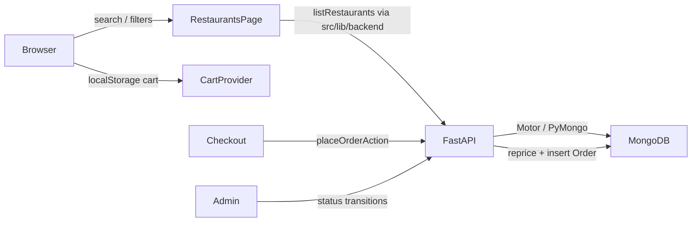

# Architecture

Two-service local demo: **Next.js App Router** (storefront + `/admin`) talks to **FastAPI** (`backend/`) over HTTP. Persistence is **MongoDB** (Atlas or local). Next owns UI, iron-session cookies, and Server Actions; FastAPI owns auth tokens, catalog, orders, and other domain writes.

## Services

| Process | Default | Role |
| --- | --- | --- |
| Next.js (`npm run dev`) | `:3000` | App Router UI, Server Actions, iron-session cookie |
| FastAPI (`uvicorn app.main:app`) | `:8000` | REST API, JWT auth, Mongo reads/writes |
| MongoDB | Atlas / local | Source of truth for users, restaurants, orders, … |

Next reaches the API via `API_BASE_URL` (default `http://127.0.0.1:8000`) through `src/lib/api.ts` and `src/lib/backend.ts`. Cloud Agents start both processes with [`scripts/cloud-agent-start.sh`](../scripts/cloud-agent-start.sh) (see [cloud-agents.md](./cloud-agents.md)).

## Data flow (browse → order)



## Location and city filtering

**Intent:** Scope restaurant browse to an Australian capital without requiring a Maps key.

| Piece | Role |
| --- | --- |
| `src/lib/cities.ts` | Canonical `DEMO_CITIES` (id + label + CBD pin). `resolveRestaurantQuery` treats a bare city name in `q` as a city filter. `matchesRestaurantCity` accepts id (`melbourne`) or label (`Melbourne`). |
| `src/components/location-provider.tsx` | Session pin in `localStorage` key `aussieeats_location_v1`. |
| `src/components/restaurant-search.tsx` | Hero/header search waits for hydration so a saved pin is not dropped, then navigates to `/restaurants?...`. |
| `src/app/(store)/restaurants/page.tsx` | Loads active restaurants from FastAPI, filters by `q` / cuisine / city / open-now / diet+allergy, optionally sorts by Haversine distance when `lat`/`lng` are present. |
| `src/lib/dietary.ts` | Diet filter ids, URL parsing (`diet=…`, `allergy=nuts`), conservative item match (untagged ≠ nut-free). A venue matches only when one item satisfies every selected diet, so browse results and the filtered menu agree; the venue-level `dietaryTags` union is display-only. |

**Constraints:**

- Mongo stores city as a **label** (`"Melbourne"`), not the slug id. Always match via `matchesRestaurantCity` / `findDemoCity`.
- Search submit must not run before `hydrated` — otherwise the city query param can be lost on first paint.
- Map pins on `/restaurants` come from the **same filtered list** as the cards (`RestaurantsExplorer`), not a separate query.

## Cart and money

**Intent:** Client cart for demo speed; FastAPI is the source of truth for charged totals at checkout.

| Piece | Role |
| --- | --- |
| `src/lib/cart-types.ts` | `unitPriceCents` is integer AUD cents. `cartSubtotalCents` = Σ(unit × quantity). |
| `src/components/cart-provider.tsx` | Persists `aussieeats_cart_v1`. One restaurant per cart. Quantity capped by `MAX_LINE_QUANTITY` (99). |
| `src/app/actions/orders.ts` → `placeOrder` in `src/lib/backend.ts` | Posts cart lines to FastAPI; backend re-reads menu prices from Mongo and ignores client unit prices for the charge. |
| `src/lib/money.ts` | Display only: `formatAUD(cents)` via `en-AU`. |

**Constraints:**

- Never pass dollars into `unitPriceCents` (regression: `priceCents / 100` broke cart totals). Admin forms convert dollars → cents with `Math.round(Number(price) * 100)`.
- Checkout recomputes subtotal from Mongo prices × validated quantities inside FastAPI.

## Opening hours and ETA

| Piece | Role |
| --- | --- |
| Restaurant `openingHoursJson` (Mongo) | Serialized Places-style periods / weekday descriptions (nullable). |
| `src/lib/opening-hours.ts` | `isOpenNow` evaluates periods in the city’s IANA timezone; falls back to `isOpen` when periods are missing. |
| `src/lib/eta.ts` | Demo ETA: ~18 min prep + ~3.2 min/km travel, clamped to 15–75 min. Origin is URL lat/lng, else the demo city pin. |

Runtime browse does **not** call Google. Hours/ratings come from seed or one-shot ingest (`npm run db:import-places` → `backend/app/import_places.py`).

## Orders and admin

| Piece | Role |
| --- | --- |
| FastAPI `orders` / `admin` routers | Create orders, list customer/admin views, status transitions. |
| `src/lib/orders.ts` | Status labels, `ALLOWED_TRANSITIONS` (mirrored in backend domain), quantity parsing helpers for UI. |
| Order `statusHistory` | Array of `{ status, at }` appended on create and admin transitions. |
| Customer timeline | `ORDER_TIMELINE_STEPS` (excludes `cancelled`). |

Allowed transitions: `pending → preparing|cancelled`, `preparing → out_for_delivery|cancelled`, `out_for_delivery → delivered|cancelled`. Terminal states have no further transitions.

## Auth and sessions

**Ownership split:**

1. **FastAPI** issues JWTs (`POST /auth/login`, `POST /auth/signup`) signed with `JWT_SECRET` (`backend/app/security.py`).
2. **Next** stores the Bearer token plus user fields in an iron-session cookie (`SESSION_SECRET`, cookie `aussieeats_session` via `src/lib/session.ts`).
3. Authed Server Actions / `apiFetchAuthed` send `Authorization: Bearer …`. Missing/invalid tokens clear the session.
4. Logout: best-effort `POST /auth/logout`, then clear the cookie. JWT remains client-held until expiry.

Roles `CUSTOMER` | `ADMIN` in `src/lib/roles.ts`. Route guards: `requireUser` / `requireAdmin` (require a JWT in session).

## Persistence and seed

- Collections live in Mongo (`MONGODB_URI` / `MONGODB_DB`). There is no Prisma/SQLite path.
- `npm run db:seed` → `cd backend && python3 -m app.seed` upserts demo users, bootstraps the handwritten catalog only when empty, and seeds sample orders/reviews once (unless `FORCE_SEED_ORDERS=1`).
- Places ingest: `npm run db:import-places` upserts by `placeId`; photos under `public/images/imported/`.

## Tests

```bash
npm test                                      # tsx --test on src/**/*.test.ts
cd backend && python3 -m pytest               # FastAPI / domain tests
```
