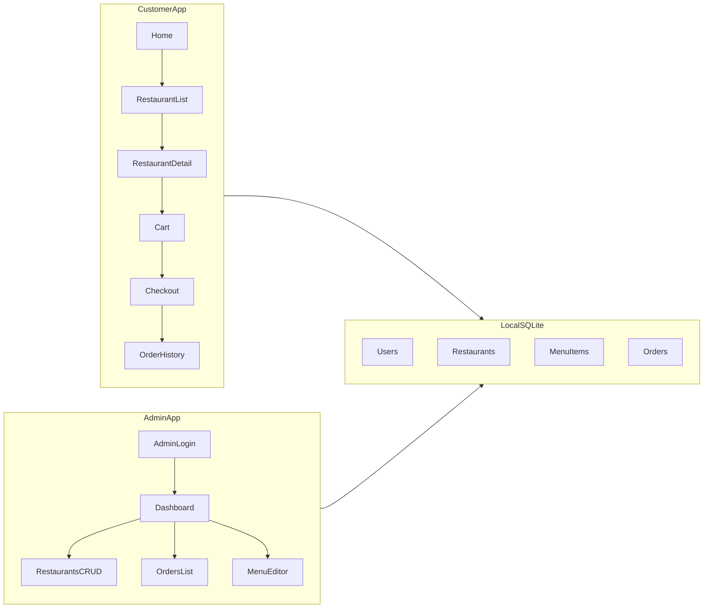

# AussieEats — Greenfield Build Spec (for a new repo)

Give the following document to an agent as the full build brief. Defaults already chosen from prior discussion: **greenfield** (not Enatega-compatible), **Australia/Sydney seed**, **customer UI + admin + login**, **fully local** (no hosted API).

---

## 1. Product intent

Build **AussieEats**, a presenter-ready multi-vendor food delivery demo that runs entirely on a laptop with zero egress to third-party food APIs.

| In scope (v1)                                                           | Out of scope (v1)                        |
| ----------------------------------------------------------------------- | ---------------------------------------- |
| Customer web: browse, restaurant menu, cart, place order, order history | Rider / driver app                       |
| Admin web: manage restaurants, menus, orders (basic)                    | Store/vendor native app                  |
| Email/password login (customer + admin)                                 | Real Stripe/PayPal/Twilio                |
| Australia seed data (Sydney-first, AUD)                                 | Maps provider dependency (optional stub) |
| Single deployable app, local DB                                         | GraphQL / Enatega API compatibility      |

**Success criteria:** `npm install && npm run dev` → open customer site → log in → set Sydney location → browse seeded restaurants → add items → checkout → see order in history; open `/admin` → see same order and edit a menu item. No calls to `*.enatega.com` or any external food API.

---

## 2. Tech stack (locked)

- **Next.js** (App Router) + **TypeScript** + **Tailwind CSS**
- **Persistence:** **SQLite via Prisma** (file at `prisma/dev.db`). Survives refresh; no separate DB server.
- **Auth:** simple session cookies (e.g. iron-session or NextAuth credentials). Demo passwords in seed only—never invent production OAuth.
- **Data access:** Server Actions and/or Route Handlers in the same Next app—**no separate Express/GraphQL service**.
- **Package manager:** npm. **Node:** 20.x.
- **Images:** local `/public` placeholders or seeded Unsplash-style URLs that degrade gracefully if offline (prefer local assets for restaurants/food).

Do **not** copy Enatega GraphQL documents, Apollo clients, or `metricsGeneral` / `bop-auth` flows.

---

## 3. Information architecture

**Routes (suggested):**

| Path                           | Role                                                                                          |
| ------------------------------ | --------------------------------------------------------------------------------------------- |
| `/`                            | Marketing/home + search entry                                                                 |
| `/restaurants`                 | List (filter by cuisine / search)                                                             |
| `/restaurants/[slug]`          | Menu + add to cart                                                                            |
| `/cart`                        | Cart                                                                                          |
| `/checkout`                    | Address + place order (COD / “Pay on delivery”)                                               |
| `/orders`                      | Logged-in order history                                                                       |
| `/orders/[id]`                 | Order detail (status stub)                                                                    |
| `/login`, `/signup`            | Customer auth                                                                                 |
| `/admin/login`                 | Admin auth                                                                                    |
| `/admin`                       | Dashboard counts                                                                              |
| `/admin/restaurants`           | CRUD restaurants                                                                              |
| `/admin/restaurants/[id]/menu` | Categories + items + prices                                                                   |
| `/admin/orders`                | List/update status (`pending` → `preparing` → `out_for_delivery` → `delivered` / `cancelled`) |

---

## 4. Domain model (Prisma sketch)

Keep models small and explicit:

- **User** — `id`, `email`, `passwordHash`, `name`, `role` (`CUSTOMER` | `ADMIN`), `createdAt`
- **Address** — optional on user; fields: label, line1, suburb, state, postcode, lat, lng (AU format)
- **Restaurant** — name, slug, description, image, cuisine tags, suburb, lat, lng, deliveryFeeCents, minOrderCents, isOpen, rating
- **Category** — restaurantId, name, sortOrder
- **MenuItem** — categoryId, name, description, priceCents, image, isAvailable
- **Cart** — client-side (React context + localStorage) is fine for v1; server only needs place-order payload
- **Order** — userId, restaurantId, status, subtotalCents, deliveryFeeCents, totalCents, deliveryAddress JSON, createdAt
- **OrderItem** — orderId, menuItemId, name snapshot, unitPriceCents, quantity

Money stored as **integer cents** in AUD. Display with `Intl.NumberFormat('en-AU', { style: 'currency', currency: 'AUD' })`.

---

## 5. Seed data (Australia-focused)

Ship `prisma/seed.ts` that creates:

**Users**

- Customer: `demo@aussieeats.local` / `demo1234`
- Admin: `admin@aussieeats.local` / `admin1234`

**Geography**

- Default map/list pin: **Sydney CBD** ≈ `-33.8688, 151.2093`
- Suburbs for restaurants: Surry Hills, Newtown, Bondi, Parramatta, Manly (mix of cuisines)
- Country/state: Australia / NSW; currency AUD; phone placeholders `+61 …`

**Catalog (minimum)**

- 6–8 restaurants (e.g. burger, Thai, pizza, cafe, sushi, Indian, Mexican, bakery)
- 3–5 categories each; 4–8 items each with realistic AU prices
- 2–3 sample past orders for the demo customer (optional)

Document in README: “If the restaurant list is empty, your browser location may be far from Sydney—use ‘Use Sydney demo location’ on home.”

---

## 6. Feature requirements (acceptance)

### Customer

1. Unauthenticated users can browse restaurants and menus.
2. Cart requires login only at checkout (or soft-prompt earlier—pick one and stick to it; prefer **login at checkout**).
3. Place order creates a DB order with status `pending` and clears cart.
4. Order history shows user’s orders; detail shows line items + status.
5. No real payment: single method **Pay on delivery**.
6. Search by restaurant name; filter by cuisine tag.

### Admin

1. Separate admin login; non-admins redirected from `/admin/*`.
2. List/create/edit/deactivate restaurants.
3. Edit menu (add/edit/toggle availability of items).
4. List orders; change status along the allowed transitions above.
5. Dashboard: counts of restaurants, open orders, customers (simple).

### Non-functional

1. Works offline w.r.t. food APIs (local SQLite + local assets).
2. Responsive enough for laptop demo (mobile-friendly layout, not native apps).
3. `npm run db:seed` resets demo data idempotently or via documented reset.
4. README with one-pager presenter script (login → Sydney pin → order → admin status change).

---

## 7. UI / design direction

- Clean food-delivery storefront: strong product name **AussieEats** in the first viewport; one primary CTA (“Find food near you” / “Browse Sydney”).
- Avoid generic AI-slop aesthetics (no purple gradients, no terracotta-on-cream cliché, no emoji-heavy UI).
- Use a clear AU-leaning palette (e.g. deep green + warm off-white + charcoal)—define CSS variables in `globals.css`.
- Prefer one composition on home: brand, short headline, one supporting line, CTA, one food imagery treatment—not a dense dashboard.
- Admin: utilitarian table/forms; clarity over marketing.

---

## 8. Explicitly do not do

- Do not depend on Enatega, `aws-server-v2.enatega.com`, or GraphQL from the old monorepo.
- Do not build rider tracking maps, chat, support tickets, coupons, tipping, or subscriptions in v1.
- Do not add Google Maps as a hard requirement (optional later); v1 can use suburb text + “Sydney demo location” button.
- Do not implement real OTP, Firebase, Stripe, or PayPal.
- Do not create Expo/mobile apps.

---

## 9. Repo deliverables

New empty repo should contain:

1. Next.js app as above
2. `prisma/schema.prisma` + migrations + `seed.ts`
3. `README.md` — Node version, `npm install`, `npx prisma migrate dev`, `npm run db:seed`, `npm run dev`, demo logins, presenter path
4. `.env.example` — `DATABASE_URL="file:./dev.db"`, `SESSION_SECRET=...`
5. Local images under `public/` for at least a few restaurants
6. Minimal smoke checklist in README (checkbox list)

---

## 10. Implementation order for the building agent

1. Scaffold Next.js + Tailwind + Prisma SQLite; User model + seed admin/customer.
2. Auth (login/signup/session) + route protection for `/orders` and `/admin`.
3. Restaurant list/detail from seed; cart context.
4. Checkout + Order/OrderItem writes; order history.
5. Admin restaurant + menu CRUD; admin orders status.
6. Polish home, empty states, Sydney demo location helper, README presenter script.
7. Manual smoke of the success criteria; fix blockers only.

---

## 11. Definition of done

- [ ] Fresh clone works with documented commands only
- [ ] Demo customer can complete an order against Sydney seed data
- [ ] Admin can change that order’s status and edit a menu price
- [ ] No runtime dependency on external food/backend APIs
- [ ] AUD formatting and AU address fields present in UI

---

## 12. One-line summary for the agent

> Build AussieEats: a local-only Next.js + Prisma/SQLite multi-vendor food delivery demo with customer storefront and `/admin`, Sydney/AUD seed data, email/password auth, cart + COD checkout—no Enatega, no GraphQL reverse-engineering, no rider apps.

